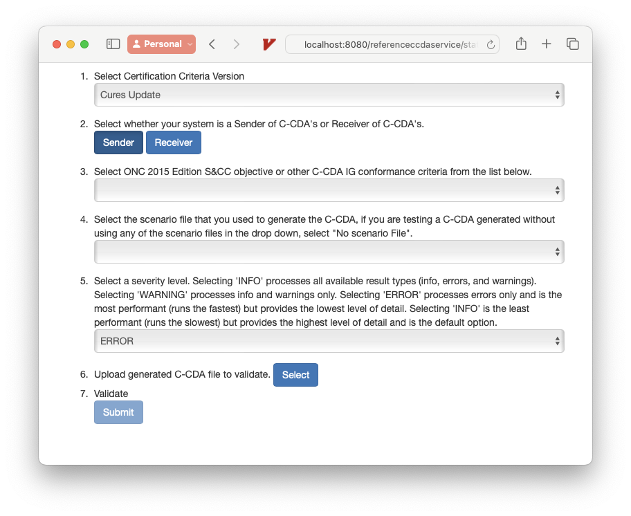
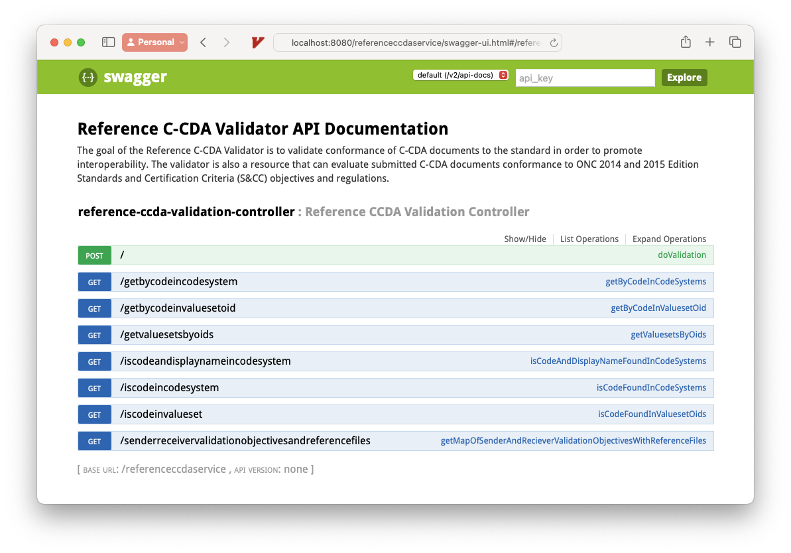
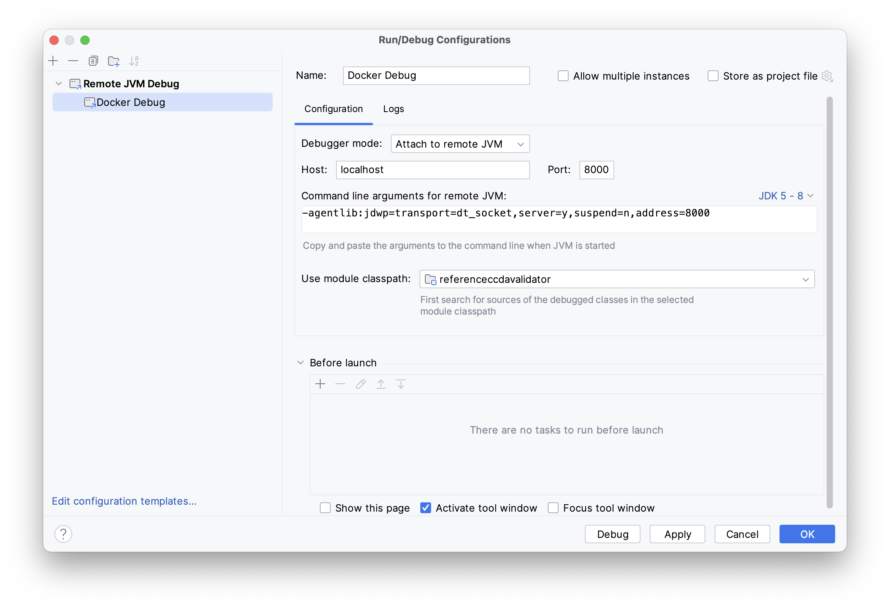
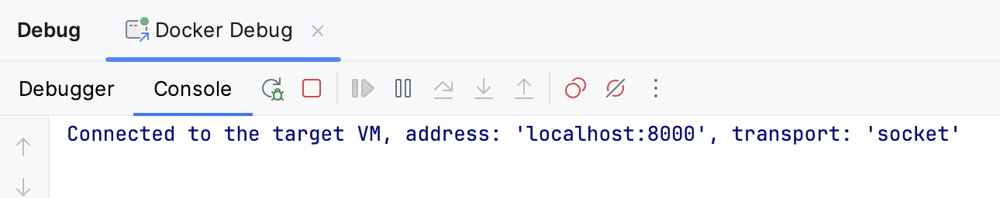
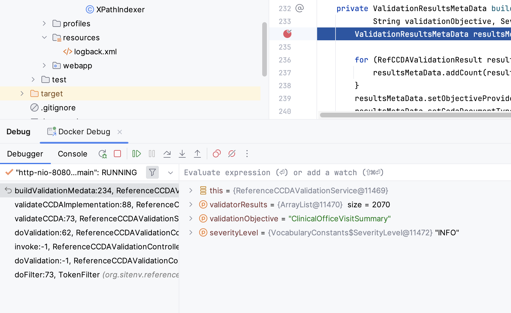
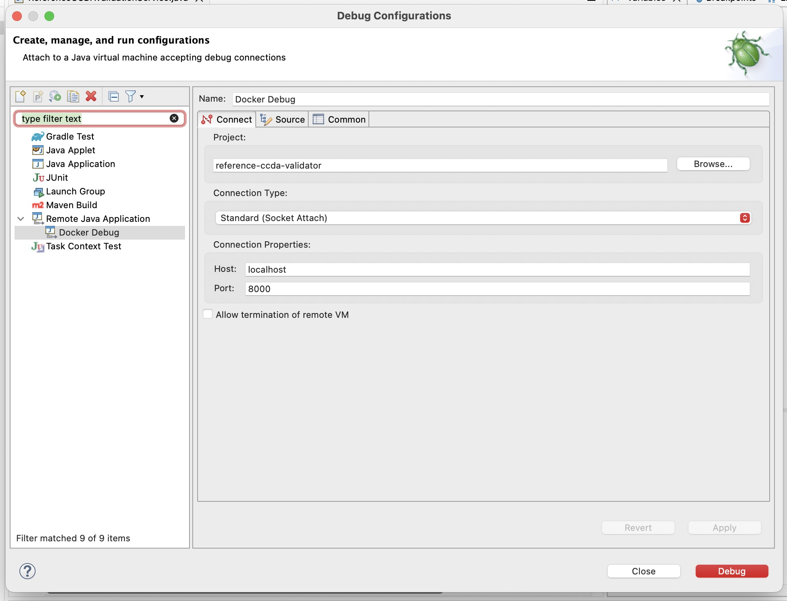
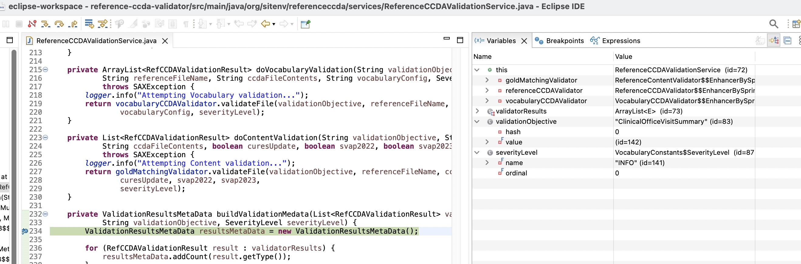

# docker-ccda-validator

CCDA Validator in a docker container

## What You'll need

- Docker
- A Reference CCDA Validator Service war file

### Reference CCDA Validator Service War

The [Dockerfile](Dockerfile) does not include any setup to add a war file when the image is built.  The intention is that you will bind mount a volume when executing the ```docker run``` command to a local directory which has a copy of the referenceccdaservice.war file.

There are two ways to get the necessary war file:

1. Build it [from code](https://github.com/onc-healthit/reference-ccda-validator/tree/develop)
   2. This is necessary if you are going to do remote debugging.
2. Grab a release from: https://github.com/onc-healthit/reference-ccda-validator/releases

## Basic Usage

### Clone The Repository

git clone this repo (and submodules! **VERY** important!)

```
git clone --recurse-submodules https://github.com/austinmoody/docker-ccda-validator.git
```

### Build the Docker Image

```
cd docker-ccda-validator
docker build -t docker-ccda-validator .
```
### Run the Docker Image in a Container

Run a Docker container using the built image.
```
docker run -d --rm \
-p 8080:8080 \
-v /Users/moodya/Dev/Fed/site/reference-ccda-validator/target:/usr/local/tomcat/webapps \
docker-ccda-validator \
/usr/local/tomcat/bin/catalina.sh run
```

_Notes_

- Remove the ```-d``` to run the container in the foreground.
- Remove the ```--rm``` to prevent the container from being removed once it is stopped.
- Tomcat is set to use the default port of 8080.  In our example the ```-p``` option exposes this same port to the host.  You could do something like ```-p 10800:8080``` to then hit port 10800 for the service from your local machine.
- We need to provide a war to deploy in /usr/local/tomcat/webapps on the running Docker container.  Since the image is not built with a war, we do this by bind mounting a local directory containing the referenceccdaservice.war file to the webapps directory using the ```-v``` option. 

### Use / Verify

Once up and running, try opening up any of the following URLS:

http://localhost:8080/referenceccdaservice/static/validationui.html



http://localhost:8080/referenceccdaservice/swagger-ui.html#/reference-ccda-validation-controller



*Note:* Using localhost above assuming you are running on your local machine using he default Tomcat port.  Obviously update the hostname and port as necessary.

## Debug Usage

To be able to debug the running war, you'll need to start tomcat with jdpa as well as expose an extra port and configure a couple other settings.

The *Clone The Repository* and *Build the Docker Image* steps above will be the same.

However, when you start the Container there are a few more options to potentially add:

- JPDA_ADDRESS & JPDA_TRANSPORT environment variables
  - ```-e JPDA_ADDRESS=8000``` &rarr; JPDA by default listens on port 8000.  You have to set this environment variable so that you can connect to the JPDA port from your local machine.  If you want the Container to internally host JPDA on a different port you would change that here.  However, if you just need to expose a different port for this on the host, just change the ```-p``` described later. 
  - ```-e JPDA_TRANSPORT=dt_socket``` &rarr; Just tells JPDA to use socket connections.  
- Publish the JDPA port 
  - ```-p 8000:8000``` &rarr; Here we expose the port for JPDA.  ```8000:8000``` means you'd connect to port 8000 from your IDE for remote debugging.  If you needed or wanted to connect to a different port (say 5005) this would instead be ```5005:8000```.
- Start tomcat with jdpa
  - ```/usr/local/tomcat/bin/catalina.sh jpda run``` &rarr; Here we simply add _jpda_ into the command to start Tomcat.

So now your _docker run_ command looks like:

```Bash
docker run -d --rm \
-e JPDA_ADDRESS=8000 \
-e JPDA_TRANSPORT=dt_socket \
-p 8080:8080 \
-p 8000:8000 \
-v /Users/moodya/Dev/Fed/site/reference-ccda-validator/target:/usr/local/tomcat/webapps \
docker-ccda-validator \
/usr/local/tomcat/bin/catalina.sh jpda run
```

Once this is running you can connect to port 8000 on the running container for remote debugging.

### Example Debug Setup

#### IntelliJ

Example _Run/Debug Configuration_ for IntelliJ:



Once configured, you will start the configuration in Debug mode.  You'll see a connection made in the console:



Then set breakpoints as normal, and when you execute functionality on the running Docker container hosted validator they will be hit.



#### Eclipse

Example _Remove Java Application_ configuration in Eclipse:



Then set breakpoints as normal, and when you execute functionality on the running Docker container hosted validator they will be hit.



## Other Information

* The Docker image is built from a base of [tomcat:8.5.96-jdk8-temurin-jammy](https://github.com/docker-library/tomcat/blob/0c3f44cacfe98b75aae3c0447b76339dc7232b33/8.5/jdk8/temurin-jammy/Dockerfile).  Current assumptions listed in the [Reference CCDA Validator](https://github.com/onc-healthit/reference-ccda-validator) project state to use Tomcat 8.5.x and JDK8.
* Value Sets in the image build are those publicly available in the [Code Validator API](https://github.com/onc-healthit/code-validator-api) project (docs/ValueSetsHandCreatedbySITE directory).  Value Sets running in production are not publicly available, but _could_ be used by changing the Dockerfile.
